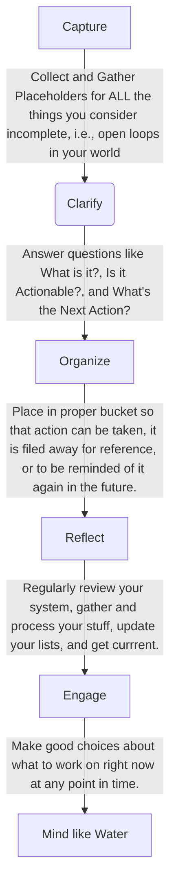

# Getting Things Done (GTD)

```ad-quote
This consistent unproductive preoccupation with all the things we have to do is the single largest consumer of our time and energy.
-- Kerry Gleeson
```

## Contents

- [[#Basic Principles of GTD|Basic Principles of GTD]]
	- [[#Five Steps of Mastering the GTD Workflow|Five Steps of Mastering the GTD Workflow]]
- [[#Definitions|Definitions]]
	- [[#Open Loops|Open Loops]]
	- [[#Projects and Next Actions|Projects and Next Actions]]
	- [[#Contexts|Contexts]]
- [[#The "Wrong" Way to Manage Tasks|The "Wrong" Way to Manage Tasks]]
- [[#Components of the GTD Dashboard|Components of the GTD Dashboard]]
- [[#GTD Demo|GTD Demo]]
- [[#Tips for Achieving "Inbox-Zero"|Tips for Achieving "Inbox-Zero"]]


## Basic Principles of GTD

GTD is **The Art of Stress-Free Productivity**.

It is a Methodology that teaches you how to:

1. Have more energy
2. Be more relaxed
3. Have more clarity and presence in the moment with whatever you are doing.
4. Get a lot more accomplished with much less effort.

```ad-quote

It is a waste of time and energy to keep thinking about something that you make no progress on.

```

### Five Steps of Mastering the GTD Workflow


	


## Definitions

### Open Loops
```ad-question
title: What is an Open Loop?

Anything considered unfinished, which, if inappropriately managed, consistently engages one's mind ineffiently.

```

### Projects and Next Actions

```ad-question
title: What is a Project?

Any desired result that can be accomplished within a year that requires more than one action step.

```

```ad-question
title: What is a Next Action?

The next physical, viable activity that progresses something toward completion.

```

### Contexts

```ad-question
title: What are Contexts?

The tool, location, or situation in which one will process and action.

```

## The "Wrong" Way to Manage Tasks

Daily to-do lists are not a good approach to task management. Why?

- Hard to nail down to-do items ahead of time due to constant new input and shifting priorities.

- If it doesn't *have* to get done that day, it dilutes the emphasis on the things that truly do.


## Components of the GTD Dashboard

## GTD Demo

## Tips for Achieving "Inbox-Zero"


***

<iframe src="https://www.slideshare.net/slideshow/embed_code/key/NR3UIpN22VJrrk" width="100%" height="485" frameborder="0" marginwidth="0" marginheight="0" scrolling="no" style="border:1px solid #CCC; border-width:1px; margin-bottom:5px; max-width: 100%;" allowfullscreen> </iframe> <div style="margin-bottom:5px"> <strong> <a href="//www.slideshare.net/SharePointWendy/create-a-gtd-dashboard-in-office-365-to-get-things-done-spbiz15-spbiz103" title="Create a GTD® Dashboard in Office 365 to Get Things Done #SPBiz15 #SPBiz103" target="_blank">Create a GTD® Dashboard in Office 365 to Get Things Done #SPBiz15 #SPBiz103</a> </strong> de <strong><a href="https://www.slideshare.net/SharePointWendy" target="_blank">Wendy Neal</a></strong> </div>


***
Links:

Sources:
- 